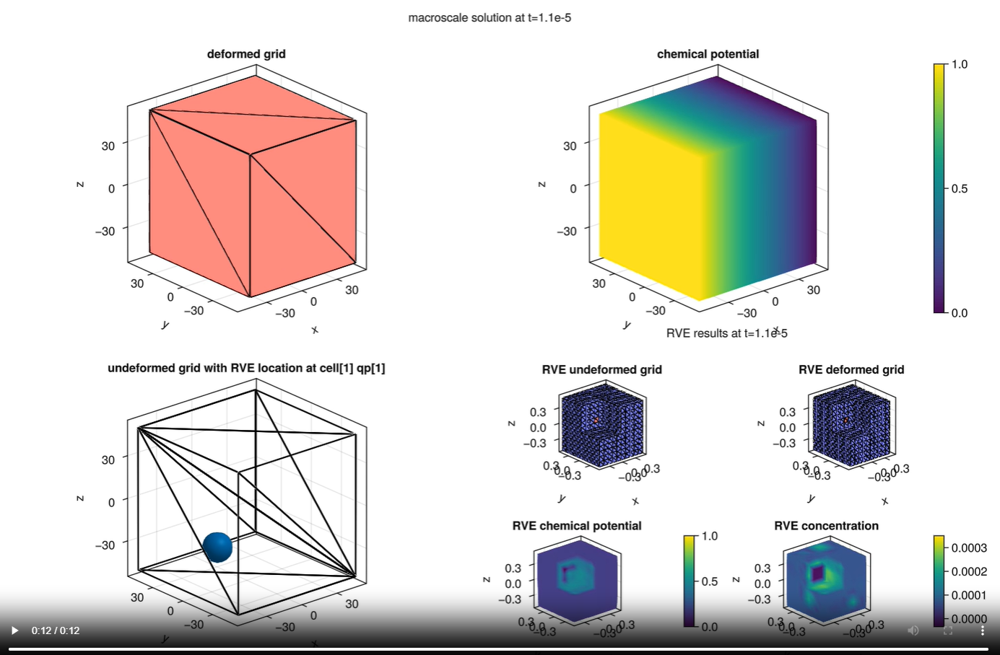
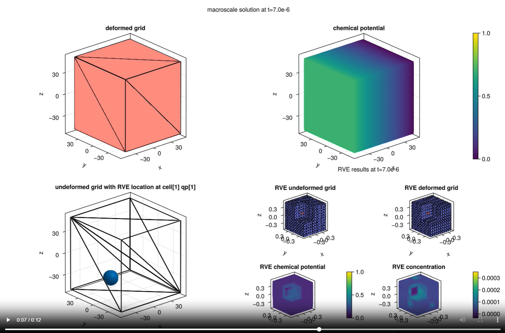

# [Chemo-Mechanical Problem - Challenges and Problems](@id documentation-challenge-probelm)

## Challenges

### Right hand side vector for RVE

Not obivous but with introducting the reference values $\boldsymbol c_\text{ref}$ and $\boldsymbol \mu_\text{ref}$ the following parts from the weak form only multiply the test shape function and can be moved to the right hand side:
```math
\begin{align}
f_\text{e}u &= \int_{\Omega} - \delta \boldsymbol \varepsilon : \boldsymbol E : \boldsymbol \alpha^\text{ch} * \boldsymbol c _\text{ref} \ d\Omega  
\\
f_\text{e}c &= \int_{\Omega} \delta c * (\mu _\text{ref} - (k + \alpha^\text{ch} : \boldsymbol E : \alpha^\text{ch} )) *  \boldsymbol c _\text{ref} \ d\Omega
\end{align}
```

### Implicit RVE boundary condition update

The RVE Boundary condition adapts the corresponding quadrature point value on macro scale and this can not be directly explictly defined on sub scale. Therefore, for every time step the new boundary condition value need to be updated before solving for the new result vector.


*Fig. 1*: Update for RVE boundary condition at each time step.

### Consistent initial guesses

The initial guess for chemical potential $\boldsymbol \mu$ and ion concentration $\boldsymbol c$ on both macro scale and sub scale need to be equal to the given reference values $\boldsymbol c_\text{ref}$ and $\boldsymbol \mu_\text{ref}$. Addition to this, the inital macro scale boundary condition and inital solution guess should align.


### Result storage throughout the time stepping

An object ``GaussPointData`` is used for the storage to ensure a direct calculation of $\bar{\boldsymbol \sigma}$, $\bar{\boldsymbol j}$, $\dot{\bar{\boldsymbol c_\text{2}}}$, $\dot{\bar{\boldsymbol c}}$.

All the macro scale result vectors and sub scale result vector at one certain quadrature point throughout the time stepping are stored in a ``NamedTuple`` respectively. 


### Combined animated plotting

Using ``observables`` from ``Makie.jl`` to create an animation for the time depenedent results. The location of the reference RVE is specified in the macro scale undeformed grid. Identical color bar for the chemical potential on both macro and sub scale to ensure a easier visual comparison.


## Remaining Problems

### Delayed adapting of RVE BC from macro scale

As it shown in the following figures, a result at the last time step `1e-5` with a time step size `1e-6`, for the reference quadrature point `cell[1]qp[1]` a chemical potential of approximately 0.5 is shown as it is in color blue. For the RVE boundary however, a blue color with a purple tone is displayed which matches the macro scale chemical potential at time step `7e-6`.


*Fig. 2*: Results for both macro scale and sub scale at time step 1e-5.


*Fig. 3*: Results for both macro scale and sub scale at time step 7e-6.

#### Possible cause
- Plotting issue: Since `Makie.jl` only plots the values on element nodes and due to the linearity of the problem, a linear gradient is generated without considering the actual quadrature point data.

### Problematic results with increasing elements in macro scale grid 

With a macro scale grid with more than one element in each direction, the results are totally unreasonable:


#### Possible cause
- wrong conditioned direct upscaling.


### Limited flexibility on RVE boundary

Due to unsolved technical issues dirichlet boundary condition is prescribed for RVE. Unlike Periodic boundary condition this overconstrains the RVE.

