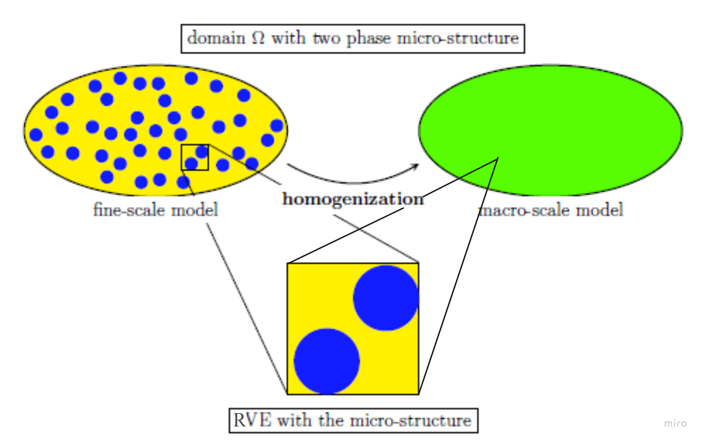

# [Chemo-Mechanical Problem - Multi Scale](@id documentation-multi-scale)
A full-scale resolution of the material microstructure provides highly accurate results but is computationally expensive. To improve efficiency while preserving accuracy, a multi-scale approach is used. This method decomposes the original fine-scale problem into a homogeneous macro-scale model and a sub-scale RVE that fully captures the microstructure.



*Fig. 1*: schematic diagram of decomposition of a fine scale problem using multi-scale method. 

## Variationally Consistent Homogenization (VCH)

By replacing integrands by running averaging on the RVE, the homogenization is introduced. The unknown fields are decomposed using the assumption of a hierachical decomposition. 

### Running Averaging on RVE
The running averaging operator for a quantity $\diamond$  is denoted for volume and surface as following:

```math
\begin{align}
\langle \diamond \rangle _{\square} &:= \frac{1}{| \Omega _{\square}|} \int_{{\boldsymbol \Omega} _{\square}} \diamond \ d  \Omega

\\
\langle \langle \diamond \rangle \rangle _{\square} &:= \frac{1}{|\boldsymbol \Gamma _{\square}|} \int_{{\boldsymbol \Gamma} _{\square}} \diamond \ d \boldsymbol \Gamma
\end{align}
```
where the corresponding homogenized macro scale field $\bar \diamond$ is often defined as $\bar \diamond := \langle \diamond \rangle _{\square}$ . 

### Hierarchical Decomposition
For the chemo-mechanical problem, displacement $\boldsymbol u$ and chemical potential $ \mu$ can be decomposed into (smooth) macro-scale $\diamond ^{M}$ and (fluctuating) sub-scale $\diamond ^{s}$ parts, where the macro-scale parts will be prescribed using Taylor expansions on each RVE. Since the concentration $ c$ is only a local quantity, no such decomposition is needed for it.

Thus, using first order Taylor expension (linear variation) the homogenized fields $\bar{\boldsymbol u}$ and $\bar{ \mu}$ are prolonged over the RVE as follows:

```math
\begin{align}
\boldsymbol u^\text{M}[\bar{\boldsymbol u}](\bar{\boldsymbol x}, \boldsymbol x ) &= \bar{\boldsymbol u}(\bar{\boldsymbol x}) + \bar{\boldsymbol \xi}(\bar{\boldsymbol x}) \cdot [x - \bar{\boldsymbol x}], \ \ \bar{\boldsymbol \xi} := \bar{\boldsymbol u}  \otimes \boldsymbol \nabla, & \ x \in \boldsymbol \Omega_\square

\\

\boldsymbol \mu^\text{M}[\bar{\boldsymbol \mu}](\bar{\boldsymbol x}, \boldsymbol x ) &= \bar{\boldsymbol \mu}(\bar{\boldsymbol x}) + \bar{\boldsymbol \zeta}(\bar{\boldsymbol x}) \cdot [x - \bar{\boldsymbol x}], \ \ \bar{\boldsymbol \zeta} := \boldsymbol \nabla \bar{\boldsymbol \mu}  , & \ x \in \boldsymbol \Omega_\square
\end{align}
```
where $\bar{\boldsymbol x}$ is centriod and also holds to the upscaling rules mentioned earlier.

## Upscaling
After inserting the hierarchical decomposition $\boldsymbol u = \boldsymbol u ^\text{M} + \boldsymbol u ^\text{s} \in \mathbb U ^\text{M} \oplus \mathbb U ^\text{s}$ and $\boldsymbol \mu = \boldsymbol \mu ^\text{M} + \boldsymbol \mu ^\text{s} \in \mathbb M ^\text{M} \oplus \mathbb M ^\text{s}$ and the upsacling assumption $\bar \diamond := \langle \diamond \rangle _{\square}$ into the fine scale week form, the two scale problem is defined:

```math
\begin{align}
\int_{\Omega} \langle \boldsymbol \sigma (\boldsymbol \varepsilon[\boldsymbol u ^{M}[\bar {\boldsymbol u}] + \boldsymbol u ^\text{s}],\boldsymbol c ^\text{s}) : \boldsymbol \varepsilon[\boldsymbol u ^{M}[ \delta \bar {\boldsymbol u} ]+ \delta\boldsymbol u ^\text{s}] \rangle _\square \ d\Omega  &=  \int_{\Gamma_N^\text{(u)}} \boldsymbol t^\text{p} \cdot \delta \bar{\boldsymbol u} \ d\Gamma
&\
\forall \delta (\bar{\boldsymbol u}, {\boldsymbol u} ^\text{s}) &\in \bar {\mathbb{U}}^\text{0} \oplus \mathbb U ^\text{s}
\\
\int_{\Omega} \langle \dot{\boldsymbol c} ^\text{s} \ [\mu ^\text{M} [\delta \bar{\boldsymbol \mu}] + \delta\mu^\text{s}] \rangle _\square \ d\Omega - \int_{\Omega} \boldsymbol \langle j(\boldsymbol \nabla[\mu ^\text{M} [\bar{\boldsymbol \mu}] + \mu^\text{s}]) \cdot \boldsymbol \nabla[\mu ^\text{M} [\delta \bar{\boldsymbol \mu}] + \delta\mu^\text{s}] \rangle _\square \ d\Omega
&=  \int_{\Gamma_N^{\mu}} \boldsymbol h^\text{p} \delta \bar{\boldsymbol \mu} \ d\Gamma
&\
\forall \delta (\bar{\boldsymbol \mu}, {\boldsymbol \mu} ^\text{s}) &\in \bar {\mathbb{M}}^\text{0} \oplus \mathbb M ^\text{s}
\\
\int_{\Omega} \langle ([\mu ^\text{M} [\bar{\boldsymbol \mu}] + \mu^\text{s}] - \boldsymbol \mu^\text{en}(\boldsymbol \varepsilon[\boldsymbol u ^\text{M}[\bar {\boldsymbol u}] + \boldsymbol u ^\text{s}], \boldsymbol c^\text{s})) \delta \boldsymbol c^\text{s} \rangle _\square \ d\Omega
&= 0
&\
\forall \delta \boldsymbol c^\text{s} &\in \mathbb{C}^\text{0}
\end{align}
```

## Weak Format Macro Scale
By with setting $\delta \boldsymbol u^\text{s}, \delta \boldsymbol \mu^\text{s}, \delta \boldsymbol \mu^\text{s}$ to 0, the globally coupled macro scale problem is established.

```math
\begin{align}
\int_{\Omega} \bar{\boldsymbol \sigma} : \boldsymbol \varepsilon[\delta \bar{\boldsymbol u}] \ d\Omega  &=  \int_{\Gamma_N^{(u)}} \boldsymbol t^\text{p} \cdot \delta \bar{\boldsymbol u} \ d\Gamma
&\
\forall \delta \bar{\boldsymbol u} \in \bar{\mathbb{U}}^{0}
\\
\int_{\Omega} \dot{\bar{ c}} \ \delta \bar{ \mu} \ d\Omega - \int_{\Omega} (\bar{\boldsymbol j} - \dot{\bar{ \boldsymbol c}}_\text{2}) \cdot \boldsymbol \nabla[\delta \bar{ \mu}] \ d\Omega
&=  \int_{\Gamma_N^{(\mu)}} \boldsymbol h^\text{p} \delta \bar{\boldsymbol \mu} \ d\Gamma
&\
\forall \delta \bar{\boldsymbol \mu} \in \bar{\mathbb{M}}^{0}
\end{align}
```

with the variationally consistent macro scale homogenized fields:

```math
\begin{align}
    \bar{\boldsymbol \sigma} &:= \langle \boldsymbol \sigma \rangle _\square = \langle \boldsymbol E \colon [\boldsymbol \varepsilon[\boldsymbol u]-\boldsymbol \alpha^\text{ch}[ c - c_{ref}]] \rangle _\square
\\
    \bar{\boldsymbol j} &:= \langle \boldsymbol j \rangle _\square = -\langle \boldsymbol M \cdot \boldsymbol \zeta[\boldsymbol \mu] \rangle _\square
\\
    \bar{ c} &:= \langle  c \rangle _\square
\\
    \bar{ \boldsymbol c_{2}} &:= \langle  c [\boldsymbol x - \bar{\boldsymbol x}] \rangle _\square
\end{align}
```
## Boundary Condition RVE
When fully adapting the microstructural details from the fine-scale problem at each macro-scale quadrature point, a consistent boundary condition must be established to ensure a uniquely solvable RVE problem: (TODO!!!!!!!!!!)

```math
\begin{align}
    \bar{\boldsymbol \varepsilon} &:= \langle \langle \boldsymbol \varepsilon \rangle \rangle _\square 
\\
    \bar{\boldsymbol \mu} &:= \langle \langle \boldsymbol \mu \rangle \rangle _\square
\\
    \bar{\boldsymbol \zeta} &:= \langle \langle \boldsymbol \zeta \rangle \rangle _\square
\end{align}
```

## Time Stepping
For every time step; the RVE problem is going to be solved at the corresponding quadrature point. The four variationally consistent macro scale fields are updated using new RVE results at current time. New stiffness matrix $\boldsymbol K^\text{n}$ is then computed with the new variationally consistent macro scale fields. A time dependent boundary condition is applied on both $\boldsymbol K^\text{n}$ and $\boldsymbol f^\text{n}$.

```math
\begin{align}

\boldsymbol K^\text{n}(\bar{\boldsymbol \sigma}^\text{n}, 
    \bar{\boldsymbol j}^\text{n}, \dot{\bar{ c}}^\text{n}, \dot{\bar{\boldsymbol c_\text{2}}}^{n}) \boldsymbol a^\text{n} &= \boldsymbol f^\text{n}
\\
\boldsymbol a^\text{n} &= (\boldsymbol K^\text{n})^\text{-1} \boldsymbol f^\text{n}

\end{align}
```